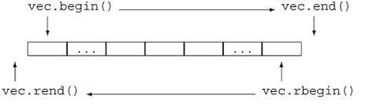

# C++ STL:map

### 1. 定义

C++ 中 map 提供的是一种键值对容器，里面的数据都是成对出现的,如下图：每一对中的第一个值称之为关键字(key)，每个关键字只能在 map 中出现一次；第二个称之为该关键字的对应值。

### 2. 特性

自动建立key － value的对应。key 和 value可以是任意你需要的类型，包括自定义类型。

常见用途：
需要建立字符或者字符串与整数之间的关系，map减少代码量。

判断大整数或者其他类型数据是否存在的题目，可以把map当作bool数组使用。

字符串和字符串的映射也会用到map

### 3. 使用

**引入头文件：**

```c++
#include <map>
using namespace std;
```

**创建：**

```c++
map<int ,string> person;
```

可以对模版进行类型定义使其使用方便

```c++
typedef map<int , string> MAP_INI_STRING;
MAP_INI_STRING person;
```

**插入数据：**

1) insert 函数插入 pair 数据

```c++
mapPerson.insert(pair < int,string > (1,"Jim"));
```

pair是将2个数据组合成一组数据，当需要这样的需求时就可以使用pair，如stl中的map就是将key和value放在一起来保存。另一个应用是，当一个函数需要返回2个数据的时候，可以选择pair。 

2)insert 函数插入 value_type 数据

```c++
mapPerson.insert(map < int, string > ::value_type (2, "Tom"));
```

每个STL中的类都有value_type这种东西，通俗的说value_type 就是stl容器盛装的数据的数据类型

3)用数组方式插入数据

```c++
mapPerson[3] = "Jerry";
```

**遍历数据：**

map可以使用it->first来访问键，使用it->second访问值

三种常见迭代方法：

1）前向迭代器

```c++
map < int ,string > ::iterator it;
    map < int ,string > ::iterator itEnd;
    it = mapPerson.begin();
    itEnd = mapPerson.end();
    while (it != itEnd) {
	cout<<it->first<<' '<<it->second<<endl;  
	it++;
}
```

2）反向迭代器

反向迭代器是一种反向遍历容器的迭代器。也就是，从最后一个元素到第一个元素遍历容器。反向迭代器将自增（和自减）的含义反过来了：对于反向迭代器，++ 运算将访问前一个元素，而 -- 运算则访问下一个元素。

回想一下，所有容器都定义了 begin 和 end 成员，分别返回指向容器首元素和尾元素下一位置的迭代器。容器还定义了 rbegin 和 rend 成员，分别返回指向容器尾元素和首元素前一位置的反向迭代器。



```c++
map < int, string > ::reverse_iterator iter;  
for(iter = mapPerson.rbegin(); iter != mapPerson.rend(); iter++) 
	cout<<iter->first<<"  "<<iter->second<<endl;  
```

3)数组形式

```c++
mapPerson.insert(map<int, string>::value_type (1, "Tom"));
mapPerson[2] = "Jim";
mapPerson[3] = "Jerry";

int nSize = mapPerson.size();
for(int n = 1; n <= nSize; n++)
	qDebug()<<QString::fromStdString(mapPerson[n]);
```

一般不使用这种形式

**map 中元素的查找：**

 find() 函数返回一个迭代器指向键值为 key 的元素，如果没找到就返回指向 map 尾部的迭代器。 

```c++
 map<int ,string > ::iterator l_it;; 
   l_it = maplive.find(112);
   if(l_it == maplive.end())
                cout<<"we do not find 112"<<endl;
   else cout<<"wo find 112"<<endl;
```

**map 中元素的删除：**

删除单个元素：

两种方法：

```c++
iterator erase（iterator it)	;//通过一个条目对象删除,it为需要删除的元素的迭代器

map<char,int>::iterator it=mp.find('b'); 
mp.erase(it);
```

```c++
mp.erase(key);//key为欲删除的映射的键

map<char,int>mp;
mp.erase('b');//删除键为b的映射
```

删除一个区间的所有元素：

```c++
iterator erase（iterator first，iterator last）；	//删除一个范围，first为需要删除的区间的起始迭代器，last是需要删除的区间末尾迭代器的下一个位置
```

**map 的 sort 问题：**

 Map 中的元素是自动按 key 升序排序,所以不能对 map 用 sort 函数：

注意在stl容器中只有vector，string，deque是可以使用sort的。因为像set，map这种容器是用红黑树实现的，元素本身有序，故不允许使用sort