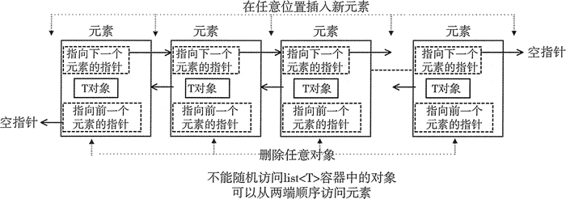

# C++ STL：list

### 1.定义：

list 容器，又称双向链表容器，即该容器的底层是以双向链表的形式实现的。这意味着，list 容器中的元素可以分散存储在内存空间里，而不是必须存储在一整块连续的内存空间中。

list容器存储元素的原理：



list 容器中各个元素的前后顺序是靠[指针](http://c.biancheng.net/c/80/)来维系的，每个元素都配备了 2 个指针，分别指向它的前一个元素和后一个元素。其中第一个元素的前向指针总为 null，因为它前面没有元素；同样，尾部元素的后向指针也总为 null。

### 2.特性

它可以在序列已知的任何位置快速插入或删除元素（时间复杂度为`O(1)`）。

不能像 array 和 vector 那样，通过位置直接访问元素。只能从第一个位置或者最后一个位置开始遍历元素。

### 3.使用

**引入头文件：**

```c++
#include <list>
using namespace std;
```

**创建list：**

```c++
list<int> values;//空容器
list<int> values(10);//包含 10 个元素，每个元素的值都为相应类型的默认值（int类型的默认值为 0）。
list<int> values(10, 5);//包含 10 个元素并且值都为 5 个 values 容器。

list<int> value1(10);
list<int> value2(value1);//通过拷贝容器的方法创建新容器


//拷贝普通数组，创建list容器
int a[] = { 1,2,3,4,5 };
std::list<int> values(a, a+5);
//拷贝其它类型的容器，创建 list 容器
std::array<int, 5>arr{ 11,12,13,14,15 };
std::list<int>values(arr.begin()+2, arr.end());//拷贝arr容器中的{13,14,15}
```

**遍历list:**

```c++
for(list<int>::iterator iter = lst1.begin();iter != lst1.end();iter++) 
 { 
  cout<<*iter; 
 } 
 cout<<endl; 
```

