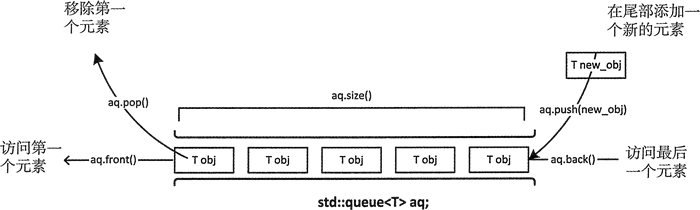

# C++ STL：queue

### 1.定义

只能访问 queue<T> 容器适配器的第一个和最后一个元素。只能在容器的末尾添加新元素，只能从头部移除元素。

容器定义以及一些基本操作：



### 2. 使用

**引入头文件：**

```c++
#include <queue>  
using namespace std;
```

**创建queue:**

```c++
queue<string> words;
```

**queue基本操作：**

```c++
q.push(x);//入队
q.pop();//出队 弹出队列的第一个元素，并不会返回元素的值；
q.front();//访问队首元素 
q.back();//访问队尾元素
q.size();//队列中的元素个数
```

