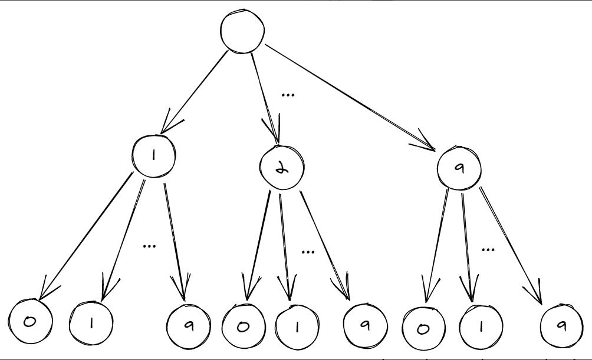

# Leetcode：DFS和BFS

### 130. 矩阵中被围绕区域

给你一个 `m x n` 的矩阵 `board` ，由若干字符 `'X'` 和 `'O'` ，找到所有被 `'X'` 围绕的区域，并将这些区域里所有的 `'O'` 用 `'X'` 填充。

**解题：**

这题主要是要区分边界上的O与区域内的O，导致BFS写法会有一些复杂。

DFS：所有边界上的O都不会被修改，并且所有没有被包围的O都直接或间接的与边界相连，用这个性质可以写出DFS代码。

```c++
class Solution {
public:
    int n, m;

    void dfs(vector<vector<char>>& board, int x, int y) {
        if (x < 0 || x >= n || y < 0 || y >= m || board[x][y] != 'O') {
            return;
        }
        board[x][y] = 'A';
        dfs(board, x + 1, y);
        dfs(board, x - 1, y);
        dfs(board, x, y + 1);
        dfs(board, x, y - 1);
    }

    void solve(vector<vector<char>>& board) {
        n = board.size();
        if (n == 0) {
            return;
        }
        m = board[0].size();
        for (int i = 0; i < n; i++) {//对边界上每一个位置执行
            dfs(board, i, 0);
            dfs(board, i, m - 1);
        }
        for (int i = 1; i < m - 1; i++) {//对边界上每一个位置执行
            dfs(board, 0, i);
            dfs(board, n - 1, i);
        }
        for (int i = 0; i < n; i++) {
            for (int j = 0; j < m; j++) {
                if (board[i][j] == 'A') {
                    board[i][j] = 'O';
                } else if (board[i][j] == 'O') {
                    board[i][j] = 'X';
                }
            }
        }
    }
};

```

**注意点：**

队列中插入pair对：

```c++
//利用c++ 11新特性
queue<pair<int,int>> q;
q.emplace(1,2);//直接写要插入的数据对即可

//原始的写法
q.push(pair<int,int>(1,2));
```

**200.岛屿数量**

利用DFS搜素，每一次DFS都要把周围的陆地1变为水域0，调用DFS的次数就是岛屿数量。

```c++
class Solution {
private:
    void dfs(vector<vector<char>>& grid, int r, int c) {
        int nr = grid.size();
        int nc = grid[0].size();

        grid[r][c] = '0';
        if (r - 1 >= 0 && grid[r-1][c] == '1') dfs(grid, r - 1, c);
        if (r + 1 < nr && grid[r+1][c] == '1') dfs(grid, r + 1, c);
        if (c - 1 >= 0 && grid[r][c-1] == '1') dfs(grid, r, c - 1);
        if (c + 1 < nc && grid[r][c+1] == '1') dfs(grid, r, c + 1);
    }

public:
    int numIslands(vector<vector<char>>& grid) {
        int nr = grid.size();
        if (!nr) return 0;
        int nc = grid[0].size();

        int num_islands = 0;
        for (int r = 0; r < nr; ++r) {
            for (int c = 0; c < nc; ++c) {
                if (grid[r][c] == '1') {
                    ++num_islands;
                    dfs(grid, r, c);
                }
            }
        }

        return num_islands;
    }
};

```

**c++ auto基本用法：**

auto的原理是根据后面的值，来推测前面的类型是什么。auto的作用就是为了简化变量初始化。

使用auto变量必须要初始化。

auto rc = q.front();


310 最小高度树，运用到了图的知识，看完图的章节再回头来做

**235 二叉搜索树最近的公共结点**

//利用二叉搜索树中序有序的特性来解决

```c++
//可以利用二叉搜索树的特性
class Solution {
    TreeNode res = null;
    public TreeNode lowestCommonAncestor(TreeNode root, TreeNode p, TreeNode q) {
        
        lca(root, p , q);
        return res;
    }
    
    public void lca(TreeNode root, TreeNode p , TreeNode q){
        if((root.val - p.val)*(root.val - q.val) <= 0){
            res = root;
        }else if(root.val < p.val && root.val < q.val){
            lca(root.right, p , q);
        }else{
            lca(root.left, p , q);
        }
    }
}
```

### 386. 字典序对数字排序

给你一个整数 `n` ，按字典序返回范围 `[1, n]` 内所有整数。

你必须设计一个时间复杂度为 `O(n)` 且使用 `O(1)` 额外空间的算法。

**利用深度优先搜索：**

如果我们将 hh 位的所有整数看做如下所示 hh 层的 kk 叉树（k \le 10k≤10），[1,n][1,n] 范围内的所有整数的字典序实际上就是这棵 k 叉树的先序遍历顺序。




**利用字典序的规律直接解决：**

```c++
class Solution {
    vector<int> ans;
public:
    void dfs(int num, int& n) {
        if (num > n) return;
        ans.push_back(num);
        for (int i = 0; i <= 9; ++i) dfs(num * 10 + i, n);
    }

    vector<int> lexicalOrder(int n) {
        for (int i = 1; i <= 9; ++i) dfs(i, n);
        return ans;
    }
};

```

