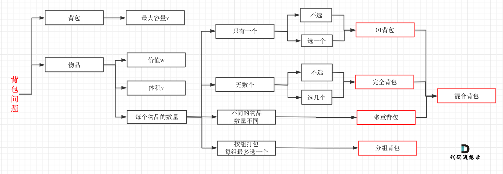

# leetcode：动态规划

## 一、背包问题

### 背包定义:

给定一个背包容量target，再给定一个数组nums(物品)，能否按一定方式选取nums中的元素得到target
注意：
1、背包容量target和物品nums的类型可能是数，也可能是字符串
2、target可能题目已经给出(显式)，也可能是需要我们从题目的信息中挖掘出来(非显式)(常见的非显式target比如sum/2等)
3、选取方式有常见的一下几种：每个元素选一次/每个元素选多次/选元素进行排列组合
那么对应的背包问题就是下面我们要讲的背包分类

### 背包问题分类：

常见的背包类型主要有以下几种：
1、0/1背包问题：每个元素最多选取一次
2、完全背包问题：每个元素可以重复选择
3、组合背包问题：背包中的物品要考虑顺序
4、分组背包问题：不止一个背包，需要遍历每个背包

而每个背包问题要求的也是不同的，按照所求问题分类，又可以分为以下几种：
1、最值问题：要求最大值/最小值
2、存在问题：是否存在…………，满足…………
3、组合问题：求所有满足……的排列组合

因此把背包类型和问题类型结合起来就会出现以下细分的题目类型：
1、0/1背包最值问题
2、0/1背包存在问题
3、0/1背包组合问题
4、完全背包最值问题
5、完全背包存在问题
6、完全背包组合问题
7、分组背包最值问题
8、分组背包存在问题
9、分组背包组合问题

### 背包问题模板：

原始背包问题的解题思路和代码：

利用二维动态规划解决

```c++
0-1背包问题代码（二维）
void bags(){
    vector<int> weight={1,3,4}; //各个物品的质量
    vector<int> value={15,20,30};//对应的价值
    int bagWeight=4;//背包能放下最重的物品
    // 二维数组：状态定义:dp[i][j]表示从0-i个物品中选择不超过j重量的物品的最大价值
    vector<vector<int>> dp(weight.size() + 1, vector<int>(bagWeight + 1, 0));

    // 初始化:第一列都是0，第一行表示只选取0号物品最大价值
    for (int j = bagWeight; j >= weight[0]; j--)
        dp[0][j] = dp[0][j - weight[0]] + value[0];

    // weight数组的大小 就是物品个数
    for (int i = 1; i < weight.size(); i++) // 遍历物品(第0个物品已经初始化)
    {
        for (int j = 0; j <= bagWeight; j++) // 遍历背包容量
        {
            if (j < weight[i])           //背包容量已经不足以拿第i个物品了
                dp[i][j] = dp[i - 1][j]; //最大价值就是拿第i-1个物品的最大价值
            //背包容量足够拿第i个物品,可拿可不拿：拿了最大价值是前i-1个物品扣除第i个物品的 重量的最大价值加上i个物品的价值
            //不拿就是前i-1个物品的最大价值,两者进行比较取较大的
            else
                dp[i][j] = max(dp[i - 1][j], dp[i - 1][j - weight[i]] + value[i]);
        }
    }
    cout << dp[weight.size() - 1][bagWeight] << endl;
}
```

二维代码可以进行优化，去除选取物品的那一层，简化为一维背包
一维状态定义：dp[j]表示容量为j的背包能放下东西的最大价值

```c++
void test_1_wei_bag_problem()
{
    vector<int> weight = {1, 3, 4};
    vector<int> value = {15, 20, 30};
    int bagWeight = 4;

    // 初始化
    vector<int> dp(bagWeight + 1, 0);
    for (int i = 0; i < weight.size(); i++)// 遍历物品
        for (int j = bagWeight; j >= weight[i]; j--)// 遍历背包容量
            dp[j] = max(dp[j], dp[j - weight[i]] + value[i]); //不取或者取第i个
    cout << dp[bagWeight] << endl;
}
```

**背包分类的模板：**

1、0/1背包：外循环nums,内循环target,target倒序且target>=nums[i];
2、完全背包：外循环nums,内循环target,target正序且target>=nums[i];
3、组合背包(考虑顺序)：外循环target,内循环nums,target正序且target>=nums[i];
4、分组背包：这个比较特殊，需要三重循环：外循环背包bags,内部两层循环根据题目的要求转化为1,2,3三种背包类型的模板

**问题分类的模板：**

1、最值问题: dp[i] = max/min(dp[i], dp[i-nums]+1)或dp[i] = max/min(dp[i], dp[i-num]+nums);
2、存在问题(bool)：dp[i]=dp[i]||dp[i-num];
3、组合问题：dp[i]+=dp[i-num];

### 322. 零钱兑换

给你一个整数数组 coins ，表示不同面额的硬币；以及一个整数 amount ，表示总金额。

计算并返回可以凑成总金额所需的 最少的硬币个数 。如果没有任何一种硬币组合能组成总金额，返回 -1 。

你可以认为每种硬币的数量是无限的。

示例 1：

输入：coins = [1, 2, 5], amount = 11
输出：3 
解释：11 = 5 + 5 + 1

```c++
class Solution {
public:
    int coinChange(vector<int>& coins, int amount) {
        int Max = amount + 1;
        vector<int> dp(amount + 1, Max);
        dp[0] = 0;
        for (int i = 1; i <= amount; ++i) {
            for (int j = 0; j < (int)coins.size(); ++j) {
                if (coins[j] <= i) {
                    dp[i] = min(dp[i], dp[i - coins[j]] + 1);
                }
            }
        }
        return dp[amount] > amount ? -1 : dp[amount];
    }
};
```


其他问题补充，见这个链接：

[一篇文章吃透背包问题！（细致引入+解题模板+例题分析+代码呈现） - 零钱兑换 - 力扣（LeetCode） (leetcode-cn.com)](https://leetcode-cn.com/problems/coin-change/solution/yi-pian-wen-zhang-chi-tou-bei-bao-wen-ti-sq9n/)

### 背包问题思维导图：




### 494. 目标和

给你一个整数数组 nums 和一个整数 target 。

向数组中的每个整数前添加 '+' 或 '-' ，然后串联起所有整数，可以构造一个 表达式 ：

例如，nums = [2, 1] ，可以在 2 之前添加 '+' ，在 1 之前添加 '-' ，然后串联起来得到表达式 "+2-1" 。
返回可以通过上述方法构造的、运算结果等于 target 的不同 表达式 的数目。

**解题关键：**

要把减法转化为加法，最后转化为0，1背包问题。

假设加法的总和为x，那么减法对应的总和就是sum - x。

所以我们要求的是 x - (sum - x) = S

x = (S + sum) / 2

此时问题就转化为，装满容量为x背包，有几种方法。

大家看到(S + sum) / 2 应该担心计算的过程中向下取整有没有影响。

这么担心就对了，例如sum 是5，S是2的话其实就是无解的，所以：

```c++
if ((S + sum) % 2 == 1) return 0; // 此时没有方案
```

同时如果 S的绝对值已经大于sum，那么也是没有方案的。

```c++
if (abs(S) > sum) return 0; // 此时没有方案
```

**代码示例：**

```c++
class Solution {
public:
    int findTargetSumWays(vector<int>& nums, int S) {
        int sum = 0;
        for (int i = 0; i < nums.size(); i++) sum += nums[i];
        if (abs(S) > sum) return 0; // 此时没有方案
        if ((S + sum) % 2 == 1) return 0; // 此时没有方案
        int bagSize = (S + sum) / 2;
        vector<int> dp(bagSize + 1, 0);
        dp[0] = 1;
        for (int i = 0; i < nums.size(); i++) {
            for (int j = bagSize; j >= nums[i]; j--) {
                dp[j] += dp[j - nums[i]];
            }
        }
        return dp[bagSize];
    }
};
```


### 297.完全平方问题

完全平方数：对于一个正整数n,找出若干个完全平方数使其和为n,返回完全平方数最少数量
完全背包的最值问题：完全平方数最小为1,最大为sqrt(n),故题目转换为在nums=[1,2.....sqrt(n)]中选任意数平方和为target=n
外循环nums,内循环target正序,应用转移方程1

```c++
int numSquares(int n)
{
    vector<int> dp(n + 1, INT_MAX); //dp[i]:和为i的完全平方数的最小数量
    dp[0] = 0;
    for (int num = 1; num <= sqrt(n); num++)
    {
        for (int i = 0; i <= n; i++)
        {
            if (i >= num * num)
                dp[i] = min(dp[i], dp[i - num * num] + 1);
        }
    }
    return dp[n];
}
```

### 完全背包的排列问题：

题目描述说是求组合，但又说是可以元素相同顺序不同的组合算两个组合，其实就是求排列！

弄清什么是组合，什么是排列很重要。

组合不强调顺序，(1,5)和(5,1)是同一个组合。

排列强调顺序，(1,5)和(5,1)是两个不同的排列。

**如果求组合数就是外层for循环遍历物品，内层for遍历背包**。

**如果求排列数就是外层for遍历背包，内层for循环遍历物品**。

如果把遍历nums（物品）放在外循环，遍历target的作为内循环的话，举一个例子：计算dp[4]的时候，结果集只有 {1,3} 这样的集合，不会有{3,1}这样的集合，因为nums遍历放在外层，3只能出现在1后面！

与**518. 零钱兑换问题**对比

[代码随想录 (programmercarl.com)](https://programmercarl.com/0518.零钱兑换II.html#思路)  零钱兑换问题

#### 377.组合综合IV

给你一个由 不同 整数组成的数组 nums ，和一个目标整数 target 。请你从 nums 中找出并返回总和为 target 的元素组合的个数。

题目数据保证答案符合 32 位整数范围。

示例：

```c++
输入：nums = [1,2,3], target = 4
输出：7
解释：
所有可能的组合为：
(1, 1, 1, 1)
(1, 1, 2)
(1, 2, 1)
(1, 3)
(2, 1, 1)
(2, 2)
(3, 1)
请注意，顺序不同的序列被视作不同的组合。

```

**解题代码：**

```c++
class Solution {
public:
    int combinationSum4(vector<int>& nums, int target) {
        vector<int> dp(target + 1, 0);
        dp[0] = 1;
        for (int i = 0; i <= target; i++) { // 遍历背包
            for (int j = 0; j < nums.size(); j++) { // 遍历物品
                if (i - nums[j] >= 0 && dp[i] < INT_MAX - dp[i - nums[j]]) {
                    dp[i] += dp[i - nums[j]];
                }
            }
        }
        return dp[target];
    }
};
```

C++测试用例有超过两个树相加超过int的数据，所以需要在if里加上dp[i] < INT_MAX - dp[i - num]。
