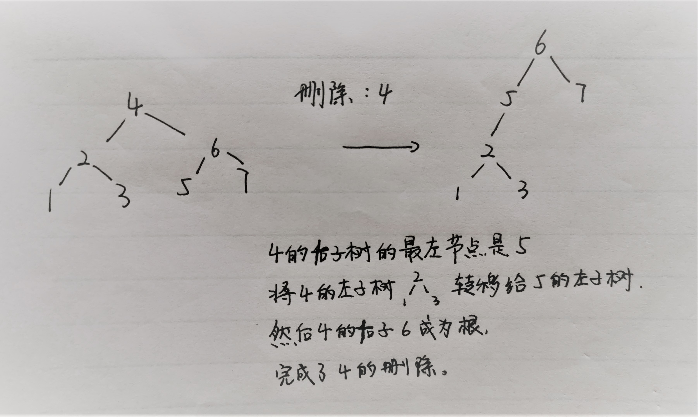

# leetcode：树

## 450. 删除二叉搜索树中的结点：

常规解法：

删除节点可以分情况讨论:

1. 如果被删除节点是 `leaf`, 直接删除
2. 如果被删除节点 `只有一个child`, 使用仅有的 child 代替原节点
3. 如果被删除节点 `有两个children`, 则在 right subtree中 寻找 successor, 将原节点值替换为 successor 的值, 并递归删除 successor, 将问题转化为 `情况1` 或 `情况2`.

C++ 版本如下:

```c++
TreeNode* deleteNode(TreeNode* root, int key) {
	if (!root) return nullptr;   // key not found in bst

	if (key < root->val) {
		root->left = deleteNode(root->left, key);
	}
	else if (key > root->val) {
		root->right = deleteNode(root->right, key);
	}
	else {
		// case 1:  if the root itself is a leaf node
		if (!root->left && !root->right) {
			return nullptr;
		}

		// case 2:  if the root only has right child
		if (!root->left && root->right) {
			return root->right;
		}

		// case 3:  if the root only has left child
		if (root->left && !root->right) {
			return root->left;
		}

		// case 4:  if the root has both left and right child
		if (root->left && root->right) {
			//  find the successor from right subtree:
			//  1. the successor must be the samllest element in subtree
			//  2. the successor could be either the right or left child of its ancestor
			auto ancestor = root;
			auto successor = root->right;
			while (successor->left) {
				ancestor = successor;
				successor = successor->left;
			}
			root->val = successor->val;
			if (successor == ancestor->right) {
				ancestor->right = deleteNode(successor, successor->val);
			}
			else {
				ancestor->left = deleteNode(successor, successor->val);
			}
		}
	}
	return root;
}
```

偷懒的解法：

二叉搜索树的高度会因此增高：

**算法思想**:
根据二叉搜索树的性质

如果目标节点大于当前节点值，则去右子树中删除；
如果目标节点小于当前节点值，则去左子树中删除；
如果目标节点就是当前节点，分为以下三种情况：
其无左子：其右子顶替其位置，删除了该节点；
其无右子：其左子顶替其位置，删除了该节点；
其左右子节点都有：其左子树转移到其右子树的最左节点的左子树上，然后右子树顶替其位置，由此删除了该节点。



```c++
class Solution {
public:
    TreeNode* deleteNode(TreeNode* root, int key) 
    {
        if (root == nullptr)    return nullptr;
        if (key > root->val)    root->right = deleteNode(root->right, key);     // 去右子树删除
        else if (key < root->val)    root->left = deleteNode(root->left, key);  // 去左子树删除
        else    // 当前节点就是要删除的节点
        {
            if (! root->left)   return root->right; // 情况1，欲删除节点无左子
            if (! root->right)  return root->left;  // 情况2，欲删除节点无右子
            TreeNode* node = root->right;           // 情况3，欲删除节点左右子都有 
            while (node->left)          // 寻找欲删除节点右子树的最左节点
                node = node->left;
            node->left = root->left;    // 将欲删除节点的左子树成为其右子树的最左节点的左子树
            root = root->right;         // 欲删除节点的右子顶替其位置，节点被删除
        }
        return root;    
    }
};
```


## 508. 出现次数最多的子树元素和

给你一个二叉树的根结点 root ，请返回出现次数最多的子树元素和。如果有多个元素出现的次数相同，返回所有出现次数最多的子树元素和（不限顺序）。

一个结点的 「子树元素和」 定义为以该结点为根的二叉树上所有结点的元素之和（包括结点本身）。

例子：

```
输入: root = [5,2,-3]
输出: [2,-3,4]
```

**解题思路：**

利用二叉树的后序遍历和哈希表（map），这里要特别注意map的用法。

```c++
class Solution {
public:

    //采用后序遍历的思想，用哈希表存储每一个子树元素和，并统计出现最大次数
    int findFrequentsum(TreeNode* root, unordered_map<int, int> &m, int &max_count){
        if(!root) return 0;

        int left = findFrequentsum(root->left, m, max_count); //左边
        int right = findFrequentsum(root->right, m, max_count); //右边

        //保存到哈希表（key-value）中的key中
        m[root->val+left+right]++; //对应的key值的value++
        max_count = max(max_count, m[root->val+left+right]); //更新最大出现次数

        return left+right+root->val; //返回上一层

    } 
    vector<int> findFrequentTreeSum(TreeNode* root) {
        std::vector<int> res;
        unordered_map<int, int> m; //定义一个哈希表
        int max_count = 0; //最大出现次数为0
        findFrequentsum(root, m, max_count);
        //在哈希表中找最大出现次数（key值）对应的value值
        //使用迭代器
        for(unordered_map<int,int>::iterator it = m.begin();it!=m.end();it++){
            if(it->second == max_count){ //如果对应value值相同
                res.push_back(it->first); //把key值放进去
            }
        }
        return res;
    }
};
```


## 662.二叉树的最大宽度

给定一个二叉树，编写一个函数来获取这个树的最大宽度。树的宽度是所有层中的最大宽度。这个二叉树与满二叉树（full binary tree）结构相同，但一些节点为空。

每一层的宽度被定义为两个端点（该层最左和最右的非空节点，两端点间的null节点也计入长度）之间的长度。

示例：

```
输入: 

           1
         /   \
        3     2
       / \     \  
      5   3     9 

输出: 4
解释: 最大值出现在树的第 3 层，宽度为 4 (5,3,null,9)。
```

来源：力扣（LeetCode）
链接：https://leetcode-cn.com/problems/maximum-width-of-binary-tree
著作权归领扣网络所有。商业转载请联系官方授权，非商业转载请注明出处。

代码：

利用层序遍历，同时记录元素偏移。

```c++
int widthOfBinaryTree(TreeNode* root) {
    int res = 0;
    queue<pair<TreeNode *, long long>> q;
    if (root) q.emplace(root, 0);
    while (!q.empty()) {
        long long first_offset = q.front().second;
        res = max(res, (int)(q.back().second - first_offset + 1));
        for (int size = q.size(), i = 0; i < size; i++) {
            auto [node, offset] = q.front(); q.pop();
            offset -= first_offset; //统一减去行首元素偏移，避免下面*2超出long long
            if (node->left) q.emplace(node->left, offset * 2);
            if (node->right) q.emplace(node->right, offset * 2 + 1);
        }
    }
    return res;
}	
```


## 863. 二叉树中所有距离为k的结点

给定一个二叉树（具有根结点 root）， 一个目标结点 target ，和一个整数值 k 。

返回到目标结点 target 距离为 k 的所有结点的值的列表。 答案可以以 任何顺序 返回。

```
输入：root = [3,5,1,6,2,0,8,null,null,7,4], target = 5, k = 2
输出：[7,4,1]
解释：所求结点为与目标结点（值为 5）距离为 2 的结点，值分别为 7，4，以及 1
```

来源：力扣（LeetCode）
链接：https://leetcode-cn.com/problems/all-nodes-distance-k-in-binary-tree
著作权归领扣网络所有。商业转载请联系官方授权，非商业转载请注明出处。

**解题思路**：**深度优先搜素+哈希表**

若将target 当作树的根结点，我们就能从 target 出发，使用深度优先搜索去寻找与 \textit{target}target 距离为 kk 的所有结点，即深度为 kk 的所有结点。

由于输入的二叉树没有记录父结点，为此，我们从根结点 root 出发，使用深度优先搜索遍历整棵树，同时用一个哈希表记录每个结点的父结点。

然后从target 出发，使用深度优先搜索遍历整棵树，除了搜索左右儿子外，还可以顺着父结点向上搜索。

代码实现时，由于每个结点值都是唯一的，哈希表的键可以用结点值代替。此外，为避免在深度优先搜索时重复访问结点，递归时额外传入来源结点 from，在递归前比较目标结点是否与来源结点相同，不同的情况下才进行递归。

```c++
class Solution {
    unordered_map<int, TreeNode*> parents;
    vector<int> ans;

    void findParents(TreeNode* node) {
        if (node->left != nullptr) {
            parents[node->left->val] = node;
            findParents(node->left);
        }
        if (node->right != nullptr) {
            parents[node->right->val] = node;
            findParents(node->right);
        }
    }

    void findAns(TreeNode* node, TreeNode* from, int depth, int k) {
        if (node == nullptr) {
            return;
        }
        if (depth == k) {
            ans.push_back(node->val);
            return;
        }
        if (node->left != from) {
            findAns(node->left, node, depth + 1, k);
        }
        if (node->right != from) {
            findAns(node->right, node, depth + 1, k);
        }
        if (parents[node->val] != from) {
            findAns(parents[node->val], node, depth + 1, k);
        }
    }

public:
    vector<int> distanceK(TreeNode* root, TreeNode* target, int k) {
        // 从 root 出发 DFS，记录每个结点的父结点
        findParents(root);

        // 从 target 出发 DFS，寻找所有深度为 k 的结点
        findAns(target, nullptr, 0, k);

        return ans;
    }
};
```

**特别注意：**

- 树是一种特殊的有向图，边的方向从父节点指向子节点
- 用 map 记录父节点后，它就是一个完完全全的有向图，不用再区分「向下搜索」和「向上搜索」，把它们都看作「图的搜索」


## 572. 另一棵树的子树

给你两棵二叉树 root 和 subRoot 。检验 root 中是否包含和 subRoot 具有相同结构和节点值的子树。如果存在，返回 true ；否则，返回 false 。

二叉树 tree 的一棵子树包括 tree 的某个节点和这个节点的所有后代节点。tree 也可以看做它自身的一棵子树。

```
输入：root = [3,4,5,1,2], subRoot = [4,1,2]
输出：true
```

来源：力扣（LeetCode）
链接：https://leetcode-cn.com/problems/subtree-of-another-tree
著作权归领扣网络所有。商业转载请联系官方授权，非商业转载请注明出处。

**解题思路：**

利用两次深度优先搜索。

这是一种最朴素的方法——深度优先搜索枚举 s 中的每一个节点，判断这个点的子树是否和 t 相等。如何判断一个节点的子树是否和 t 相等呢，我们又需要做一次深度优先搜索来检查，即让两个指针一开始先指向该节点和 t 的根，然后「同步移动」两根指针来「同步遍历」这两棵树，判断对应位置是否相等。

```c++
class Solution {
public:
    bool check(TreeNode *o, TreeNode *t) {
        if (!o && !t) {
            return true;
        }
        if ((o && !t) || (!o && t) || (o->val != t->val)) {
            return false;
        }
        return check(o->left, t->left) && check(o->right, t->right);
    }

    bool dfs(TreeNode *o, TreeNode *t) {
        if (!o) {
            return false;
        }
        return check(o, t) || dfs(o->left, t) || dfs(o->right, t);
    }

    bool isSubtree(TreeNode *s, TreeNode *t) {
        return dfs(s, t);
    }
};
```


## 652. 寻找重复的子树

给定一棵二叉树 root，返回所有重复的子树。

对于同一类的重复子树，你只需要返回其中任意一棵的根结点即可。

如果两棵树具有相同的结构和相同的结点值，则它们是重复的。

 示例：

```c++
输入：root = [1,2,3,4,null,2,4,null,null,4]
输出：[[2,4],[4]]
```

来源：力扣（LeetCode）
链接：https://leetcode-cn.com/problems/find-duplicate-subtrees
著作权归领扣网络所有。商业转载请联系官方授权，非商业转载请注明出处。

**解题思路：DFS+哈希表+序列化**

- 将二叉树序列化并存储在哈希表中，统计每棵子树对应序列出现的次数，如果在哈希表中已经出现过了，就把根节点放入结果数组中；

```c++
class Solution {
public:
    string dfs(TreeNode* root, vector<TreeNode*>& res, unordered_map<string, int>& mp){
        if(root==NULL) return "";
        //二叉树先序序列化
        string str = to_string(root->val) + "," + dfs(root->left, res, mp) + "," + dfs(root->right, res, mp);
        
        if(mp[str]==1){
            res.push_back(root);
        } 
        mp[str]++;
        return str;
    }

    vector<TreeNode*> findDuplicateSubtrees(TreeNode* root) {
        vector<TreeNode*> res;
        unordered_map<string, int> mp;
        dfs(root, res, mp);
        return res;
    }

};
```

