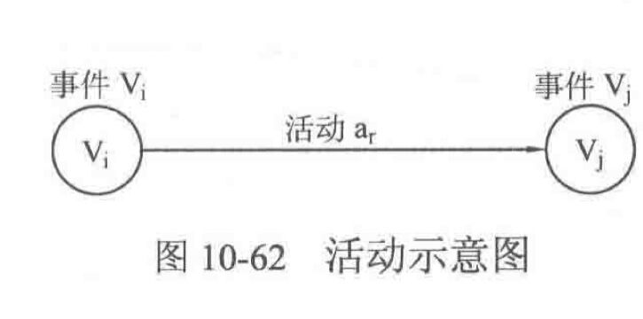

# 数据结构：图2

# 拓扑排序：

### 基本思路和代码实现：

1. 定义一个队列，并把所有入度为0的结点加入队列
2. 取队首结点，输出。然后删去从它出发的所有边，并令这些边到达的顶点的入度减1，如果某个顶点的入度为0，则将其加入队列。
3. 反复进行2操作，直到队列为空为止。如果队列为空的时候入过队的结点数目恰好为N，说明，拓扑排序成功，否则拓扑排序失败，图中有环。

```c++
vector<int> g[maxn];//邻接表
int n,m,inDegree[maxn];//顶点数，入度
//拓扑排序
bool topologicalSort(){
    int num=0;//记录加入拓扑排序的顶点
    queue<int> q;
    for(iny i=0;i<n;i++){
        if(inDegreee[i]==0)
            q.push(i);//将所有入度为0的顶点入队
    }
    while(!q.empty()){
        int u=q.front();
        //cout<<u; //此处可以输出顶点，作为拓扑序列中的顶点
        q.pop();
        for(int i=0;i<g[u].size();i++){
            int v=g[u][i];
            inDegree[v]--;//顶点v的入度减1
            if(inDegree[v]==0){
                q.push(v);
            }
        }
        g[u].clear() //清空顶点u的所有出边
        num++; //加入拓扑序列的顶点数加1
    }
    if(num==n) return true; //拓扑排序成功
    else return false; //拓扑排序失败
}
```

拓扑排序很重要的一点应用就是判断一个给定的图是否是有向无环图。正如上面代码，如果topologicalSort（）函数返回true，说明拓扑排序成功，给定的图是有向无环图；否则说明拓扑排序失败，图中有环。

最后指出，如果要求有多个入度为0的顶点，选择编号最小的顶点，那么把queue改成priority_queue,并保持队首元素是优先队列中的最小元素即可。


## 关键路径

**AOV网和AOE网：**

顶点活动（AOV）网是指用顶点表示活动，用边集表示活动间优先关系的有向图。

边活动（AOE）网是指用带权的边集表示活动，而用顶点表示事件的有向图，其中边权表示完成活动需要的时间。一般来说AOE网用来表示一个工程的进行过程，AOE网不应该有环。

AOE网中最长路径被称为关键路径，关键路径上的活动称为关键活动。

**最长路径：**

对于一个没有正环的图（指从源点可达的正环），如果要求最长路径长度，则可以把所有边的边权乘以-1，令其变为相反数，然后使用Bellman-Ford算法或者SPFA算法求最短路径长度，将所得结果取反即可。

**关键路径：**

由于AOE网实际上是有向无环图，而关键路径是图中的最长路径，因此本节实际上给出了一种求解有向无环图中最长路径的方法。

设置数组e，l，其中e[r]和l[r]分别表示活动ar的最早开始时间和最迟开始时间。于是，求出这两个数组以后，就可以通过判断e[r]==l[r]是否成立来确定活动r是否是关键活动。

设置数组ve和vl，其中ve[i]和vl[i]分别表示事件i的最早发生时间和最迟发生时间，然后就可以将求解e[r]和l[r]转换为求解这两个新数组：



1. 对活动ar来说，只要在事件vi最早发生时候马上开始,就可以使得活动ar的开始时间最早，因此e[r]=ve[i];
2. 如果l[r]是活动ar的最迟开始时间，那么l[r]+length[r]就是事件vj的最迟开始时间（length[r]表示活动ar的边权），因此l[r]=vl[j]-length[r].

注意:通过前驱结点去寻找所有的后继结点很容易，但是通过后继结点vj去寻找它的前驱结点Vi1~Vik不容易，比较好的方法是，在拓扑排序访问到某个结点vi时，不是让它去找前驱结点来更新ve[i]，而是使用ve[i]去更新其所有后继结点的ve值。

代码如下：

```c++
//拓扑序列
stack<int> topOrder;
bool topologicalSort(){
    queue<int> q;
    for(int i=0;i<n;i++){
        if(inDegree[i]==0){
            q.push(i);
        }
    }
    while(!q.empty()){
        int u=q.front();
        q,pop();
        topOrder.push(u);//将u加入拓扑序列；
        for(int i=0;<G[u].size();i++){
            int v=G[u][i].v;
            inDegree[v]--;
            if(inDegree[v]==0){
                q.push(v);
            }
            //用ve[u]来更新u的所有的后继结点v
            if(ve[u]+G[u][v].w>ve[v]){
                ve[v]=ve[u]+G[u][v].w;
            }
        }
    }
    if(topOrder,size()==n) return true;
    else return false;
}
```

和ve数组类似，如果需要算出vl[i]的正确值，vl[j1]~vl[jk]必须已经得到。这个要求和ve数组刚好相反，也就是需要在访问某个结点时候保证它的后继结点都已经访问完毕，而这可以通过逆拓扑序列来实现。但是不用再做一次逆拓扑排序，而是可以通过颠倒拓扑排序序列来得到一组合法的逆拓扑序列。在上面实现拓扑排序的过程中使用了栈来存储拓扑序列，只需要按顺序出栈就是逆拓扑序列。而当访问逆拓扑序列中的每个事件vi时候，就可以遍历vi的所有后继结点

代码如下：

```c++
fill(vl,vl+n,ve[n-1]);//vl数组初始化，初始值为终点的ve值

//直接使用topOrder出栈即为逆拓扑序列，求解vl数组
while(!topOrder.empty()){
    int u=topOrder.top();//栈顶元素为u
    topOrder.pop();
    for(int i=0;i<g[u].size();i++){
        int v=G[u][i].v;
        if(v1[v]-G[u][i].w<vl[u]){
            vl[u]=vl[v]-G[u][i].w;
        }
	}
}
```

上述过程的总结：

```c++
//关键路径，不是有向无环图返回-1，否则返回关键路径长度
int CriticialPath(){
    memset(ve,0,sizeof(ve));//ve数组初始化
    if(topologicalSort()==false){
        return -1;
    }
    fill(v1,v1+n,ve[n-1]);//v1数组初始化，初始值为汇点的ve值
    //直接使用topOrder出栈即为逆拓扑序列，求解vl数组
while(!topOrder.empty()){
    int u=topOrder.top();//栈顶元素为u
    topOrder.pop();
    for(int i=0;i<g[u].size();i++){
        int v=G[u][i].v;
        if(v1[v]-G[u][i].w<vl[u]){
            vl[u]=vl[v]-G[u][i].w;
        }
	}
}
    
    //遍历邻接表的所有边，计算活动的最早开始时间e和最迟开始时间l
    for(int u=0;u<n;u++){
        for(int i=0;i<G[u].size();i++){
            int v=G[u][i].v,w=G[u][i].w;
            //活动的最早开始时间e和最迟开始时间l
            int e=ve[u],l=vl[v]-w;
            //如果e==l说明活动u->v是关键活动
            if(e==l){
                cout<<u<<" "<<v;
            }
        }
    }
    return ve[n-1];//返回关键路径长度
}
```

