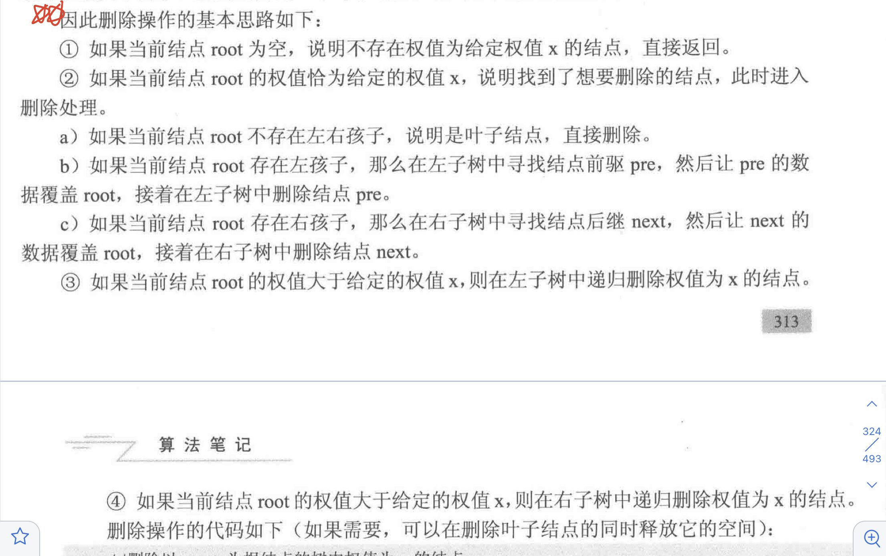
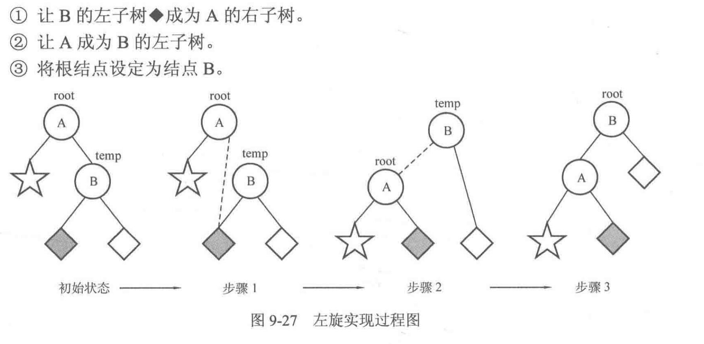
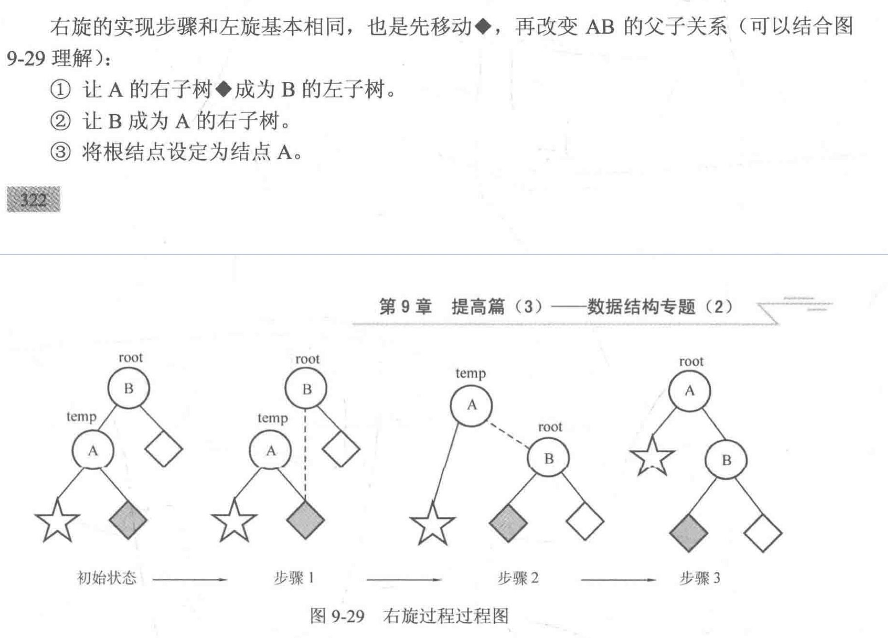
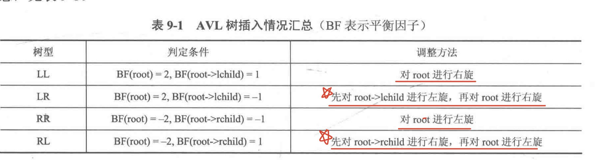

# 数据结构：树和二叉树的应用

### 1. 树的基本数据结构和操作：

一般在考试之中采用静态写法比较合适，即用数组下标代替所谓的地址。

**结构体node定义：**

```c++
struct node{
	typename data;
    int child[maxn];
}Node[maxn];
```

注意：因为无法预知子结点的个数，child数组长度只能开到最大但是可能导致开辟的空间超出题目的要求限制。因此需要使用c++STL中的vector

```c++
struct node{
	typename data;
	vector child;
}node[maxn];
```

**创建一个新结点：**

```c++
int index=0;
int newNode(int v){
	Node[index].data=v;
	Node[index].child.clear();
	return index++;
}
```

*注意点：*

如果题目中不涉及结点的数据域，即只需要树的结构，那么上面的结构体可以简化为vector数组，即vector<int>

child[maxn]。显然，在这种定义之下，child[0],child[1] ...等中的每一个都是一个vector，存放了各结点所有子结点的下标。

### 2. 树的遍历

**树的先根遍历：**

```c++
void preorder(int root){
	cout<<Node[root].data;
	for(int i=0;i<Node[root].child.size();i++){
		preorder(Node[root].child[i]);
	}
}
```

**树的层序遍历：**（难点，借助队列解决）

使用一个队列来存放结点在数组之中的下标，每次取出队首元素来访问，并且将其余所有子结点加入队列。

```c++
void layerorder(int root){
    queue<int> q;
    q.push(root);
    while(!q.empty()){
        int front=q.front();
        q.pop();
        cout<<Node[front].data;
        for(int i=0;i<Node[front].child.size();i++){
            q.push(Node[front].child[i]);
        }
    }
}
```

如果需要利用结点层号：

```c++
struct node{
	int layer;
	int data;
	vector<int> child;
}

void layerorder(int root){
    queue<int> q;
    q.push(root);
    Node[root].layer=0;
    while(!q.empty()){
        int front=q.front();
        q.pop();
        cout<<Node[front].data;
        for(int i=0;i<Node[front].child.size();i++){
            int child=Node[front].child[i];
            Node[child].layer=Node[front].layer+1;
            q.push(child);
                
        }
    }
}
```

### 3. 二叉查找树的基本操作：

**插入操作：**

```c++
void insert(node* &root,int x){
	if(root==NULL){
		root=newNode(x);
        return;
	}
    if(x==root->data){
        return;
    }else if(x<root->data){
        insert(root-lchild,x);
    }else{
        insert(root->rchild,x);
    }
    
}
```

**二叉查找树的建立：**

```c++
node* create(int data[],int n){
	node* root=NULL;
    for(int i=0;i<n;i++){
        insert(root,data[i]);
    }
    return root;
}
```

**二叉查找树的删除操作**：



```c++
void deleteNode(node* &root,int x){
    if(root==NULL) return;
    if(root->data==x){
        if(root->lchild==NULL&&root->rchild==NULL){
            root=NULL;
        }else if(root->lchild!=NULL){
            node* pre=findMax(root->lchild);
            root->data=pre->data;
            deleteNode(root->lchild,pre->data);//左子树之中删除结点pre
        }else{
            node* next=findMin(root->rchild);
            root->data=next->data;
            deleteNode(root->rchild,next->data);
        }
    }else if(root->data>x){
            deleteNode(root->lchild,x);
        }else {
            deleteNode(root->rchild,x);
        }  
}

//寻找以root为根结点的树中的最大权值结点
node* findMax(node* root){
    while(root->rchild!=NULL){
        root->rchild;
    }
    return root;
}

node* findMin(node* root){
    while(root->lchild!=NULL){
        root=root->lchild;
    }
    return root;
}
```

注意总是优先删除前驱会导致树的左右子树高度极度不平衡。解决这一问题可以，记录子树高度，总是优先在高度较高的一颗子树里删除结点。


### 4. 二叉平衡树（AVL树）

**结构体node定义：**

```c++
struct node{
    int v,height;//height为当前子树的高度
    node *lchild,*rchild;
}
```

**创建一个新结点：**

```c++
node *newNode(int v){
	node* Node=new node;
    Node->data=v;
    Node->height=1;
    Node->lchild=Node->rchild=NULL;
    return Node;
}
```

获取当前结点高度：

```c++
int getheight(node* root){
    if(root==NULL) return 0;
    return root->height;
}
```

**计算结点的平衡因子：**

```c++
int getbalanceFactor(node* root){
	return getheight(root->lchild)-getheight(root->rchild);
}
```

注意：

结点root的所在子树的height等于其左子树height与右子树height的较大值加1

**更新高度的函数：**

```c++
void updataHeight(node* root){
    root->height=max(getheight(root->lchild),getheight(root->rchild))+1;
}
```

**插入操作：**


左旋调整步骤：



```c++
//左旋（Left Rotation)
void L(node* &root){
    node* temp=root->rchild;
    root->rchild=temp->lchild;
    temp->lchild=root;
    updateHeight(root);
    updateHeight(temp);
    root=temp;
}
```



```c++
//右旋（right rotation)
void R(node* &root){
    node* temp=root->lchild;
    root->lchild=temp->rchild;
    temp->rchild=root;
    updateHeight(root);
    updateHeight(temp);
    root=temp;
}
```



```c++
//插入权值为v的结点
void insert(node* &root,int v){
    if(root==NULL){
        root=newNode(v);
        return;
    }
    if(v<root->v){
        insert(root->lchild,v);//往左子树插入
        updateHeight(root);//更新树高
        if(getBalanceFactor(root)==2){
            if(getBalanceFactor(root->lchild)==1){//LL型
                R(root);
            }else if(getBalanceFactor(root->lchild)==-1){//LR型
                L(root->lchild);
                R(root);
            }
        }
    }else{
        insert(root->rchild,v);//往右子树插入
        updateHeight(root);//更新树高
        if(geBalanceFactor(root)==-2){
            if(getBalanceFactor(root->rchild)==-1){//RR型
                L(root);
            }else if(getBalanceFactor(root->rchild)==1){//RL型
                R(root->rchild);
                L(root);
            }
        }
    }
}
```

**AVL树的创建：**

```c++
node* create(int data[],int n){
	node* root==NULL;
    for(int i=0;i<n;i++){
        insert(root,data[i]);
    }
    return root;
}
```


### 5. 并查集的基本操作

并查集用数组father[N]实现。如果father[i]=i,说明元素i是该集合的根结点，对于同一个集合来说只存在一个根结点。

**初始化：**

```c++
for(int i=0;i<N;i++){
	father[i]=i;//father[i]=-1也可以
}
```

**查找：**

对给定的结点寻找其根结点

```c++
int findFather(int x){
    while(x!=Father[x])
        x=father[x];
    return x;
}
```

**合并：**

把两个集合合并为一个集合，先要判断两个元素是否属于不同的集合。

```c++
int Union(int a,int b){
    int faA=findFather(a);
    int faB=findFather(b);
    if(faA!=faB){
        father[faA]=faB;
    }
}
```

**路径压缩：**

步骤：

- 按照原来的写法获得x的根结点r
- 重新从x开始走一遍寻找根结点的过程，把路径上经过的所有结点的父亲全部改为根结点r。

```c++
int findFather(int x){
    int a=x;
    while(x!=father[x]){
        x=father[x];
    }
    //到这一步为止，x存放的是根结点。下面把路径上所有结点的father都改为根结点
    while(a!=father[a]){
        int z=a;
        a=father[a];//a回溯父亲结点
        father[z]=x;
    }
    return x;
}
```

